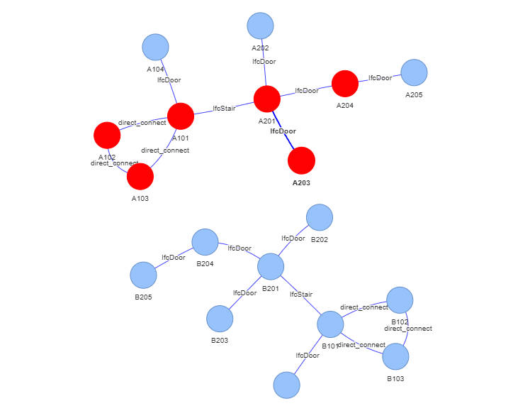

# IFC Geometry Handling Library

[TOC]

## Project Introduction

This project mainly achieve some function related to geometry problem in IFC. Specific functions are as below.

1. Components Clash Detection
2. Calculate the distance between components
3. Get objects of a certain type within a certain range of a particular component.
4. Determine whether one component is contained in other component.
5. Get objects of a certain type in a certain direction of an component.
6. Building graph of the IFC model based on the accessibility of space.
7.  Use Floyd-Warshall algorithm to calculate the shortest distance between two space.

## Result

+ IFC model

  

+ Graph for the building

  

